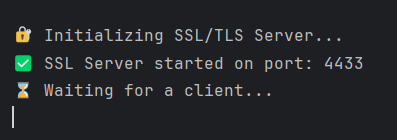
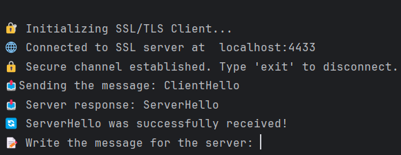
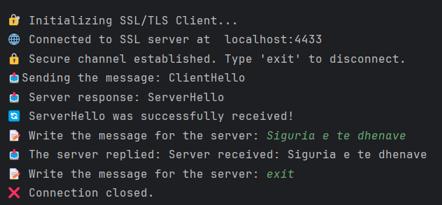
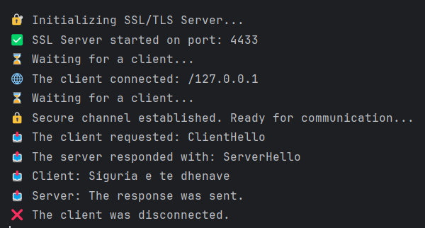
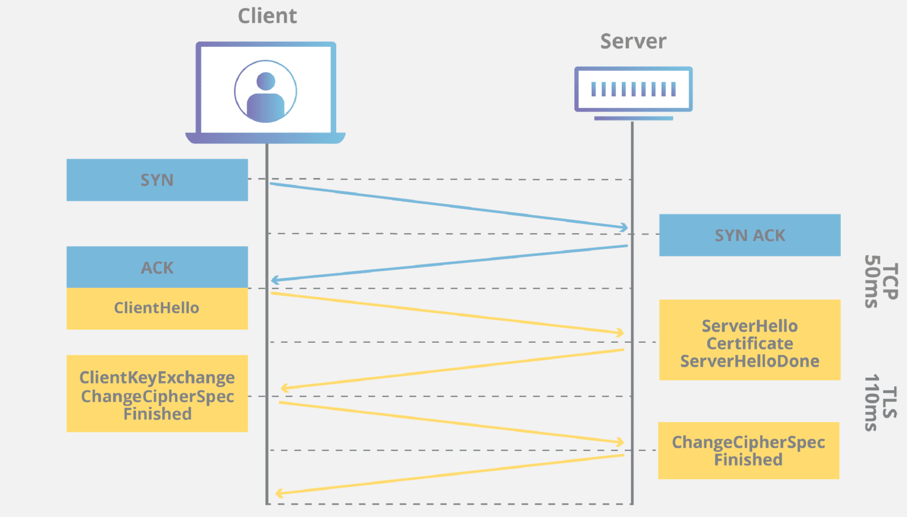

# DS_Grupi8_D3

# 🔐 Simulimi i SSL/TLS Handshake me Verifikim të Certifikatave në Java
Ky projekt simulon një proces të plotë të SSL/TLS Handshake midis një **klienti** dhe një **serveri** duke përdorur teknologji të sigurisë së lartë. Përfshin:
- Verifikimin e certifikatave X.509
- Shkëmbimin e çelësave me Diffie-Hellman
- Komunikimin e enkriptuar të sigurt

---

## 🧰 Kërkesat për ekzekutim

- Java JDK 8 ose më e lartë
- Keytool (për gjenerimin e certifikatave)
- Certifikatat e nevojshme në folderin src/main/resources/certificates/

---

## 🚀 Si të ekzekutohet programi

### Përmes IDE-së:
1. Hap projektin në IDE-në tuaj (Eclipse, IntelliJ, etj.)
2. Së pari ekzekuto ServerApp.java për të nisur serverin.
3. Pastaj ekzekuto ClientApp.java për të nisur klientin
 ```
 Përmes terminalit:
1. Hap terminalin në IntelliJ (alt+f12) sigurohu qe je ne rrenjen e projektit:
 p.sh cd C:\Users\HP\IdeaProjects\DS_Grupi8_D3
 
2. Kompilo të gjitha .java nga të gjitha nënfolderët
javac -d out (Get-ChildItem -Recurse -Filter *.java | ForEach-Object { $_.FullName })
Kjo do i kompilojë të gjitha klasat dhe do i ruajë në folderin out.

3. Ekzekuto Server-in
java -cp out server.ServerApp

4. Ekzekuto Client-in (në një dritare të re të terminalit)
java -cp out client.ClientApp

 ```
## 📋 Udhëzime për përdorim
Fillimisht nisni serverin
Pastaj nisni klientin
Ndiqni udhëzimet në ekran për të shkëmbyer mesazhe të sigurta
Shkruani "exit" për të mbyllur lidhjen


🔄 Logjika e rrjedhës\
Kur ekzekutoni ServerApp:\


Kur ekzekutoni ClientApp pas ServerApp:\


Shënoni kodin për serverin:\


Pamja tek serveri:\



## Përshkrimi i SSL TLS HANDSHAKE - HISTORIA
SSL (Secure Sockets Layer) dhe TLS (Transport Layer Security) janë protokolle të sigurisë që ofrojnë komunikim të sigurt në rrjetet kompjuterike, si p.sh. në internet.

SSL u krijua fillimisht nga Netscape në vitin 1995 për të siguruar komunikim të sigurt mes shfletuesve të internetit dhe serverëve.

TLS është evolucioni i SSL. TLS 1.0 u prezantua në vitin 1999 për të zëvendësuar SSL 3.0 me përmirësime të mëdha në siguri.

Handshake është procesi fillestar kur një klient (browser, aplikacion) dhe serveri vendosin një sesion të sigurt. 

### 🔐 Procesi i SSL/TLS Handshake:
Klienti fillon Handshake duke dërguar versionin e TLS dhe algoritmet e mbështetura.
Hapat:\
ClientHello → Klienti fillon Handshake dhe propozon algoritmet.  
ServerHello → Serveri përgjigjet dhe zgjedh parametrat e enkriptimit.  
Certificate → Serveri dërgon certifikatën për verifikim.  
ServerKeyExchange → Parametrat për shkëmbimin e çelësave.  
ClientKeyExchange → Klienti gjeneron dhe dërgon çelësin e përkohshëm.  
ChangeCipherSpec → Fillon enkriptimi i komunikimit.  
Finished → Klienti dhe serveri konfirmojnë përfundimin.


# Përshkrimi i File-ve:
📄 CertificateManager.java

Ngarkon dhe verifikon certifikatat X.509.\
Kontrollon nëse janë të nënshkruara nga një CA e besuar.

📄 KeyExchangeManager.java

Simulon shkëmbimin e çelësave me Diffie-Hellman.\
Gjeneron një çelës të përbashkët AES për enkriptim.

📄 HandshakeSimulator.java

Orkestron rrjedhën e plotë të Handshake:\
ClientHello → ServerHello\
ServerKeyExchange → ChangeCipherSpec\
Finished

📄 ChangeCipherSpec.java

Sinjalizon që komunikimi do të jetë i enkriptuar.

📄 Finished.java

Dërgon mesazhin "Finished" për të përfunduar Handshake.

📄 Handshake.java

Menaxhon procesin e Handshake në server.\
Trajton shumë klientë në mënyrë paralele.

📄 ServerHello.java

Simulon mesazhin "ServerHello".

📄 ServerKeyExchange.java

Dërgon parametrat e shkëmbimit të çelësave.

📄 ServerApp.java

Krijon një SSLServerSocket të sigurt.\
Pranon shumë klientë njëkohësisht.

📄 ClientApp.java

Lidhet me serverin me TrustStore.\
Kryen Handshake dhe dërgon mesazhe të enkriptuara.

## 👤 Autorët:
- Leon Troni
- Leona Zullufi
- Leonita Rama
- Liridona Kurrumeli
